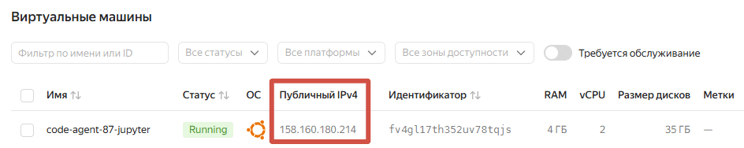
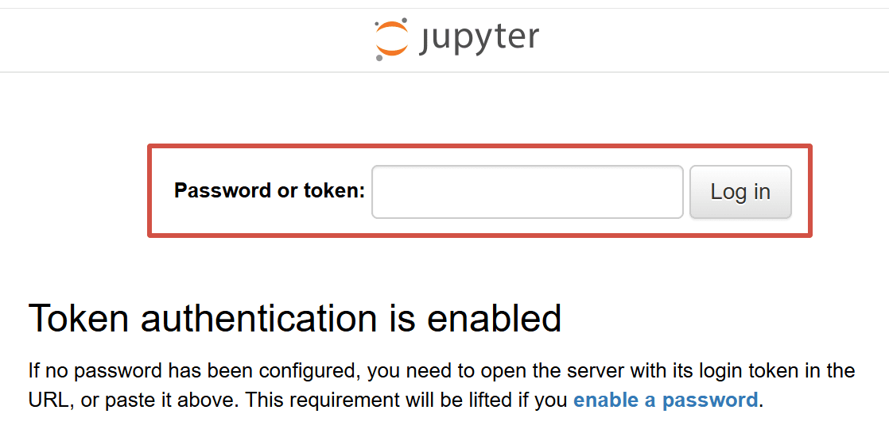

# SCALE 2026 Workshop: Многоагентные системы в Yandex AI Studio: пишем своего кодинг‑агента для анализа данных

[English Version](README_en.md) | [Инструкция для самостоятельного выполнения](README.md)

Это инструкция для мастер-класса **Многоагентные системы в Yandex AI Studio: пишем своего кодинг‑агента для анализа данных**.

## Получаем доступ к Yandex Cloud и AI Studio

В ходе регистрации на мероприятии вы должны были получить письмо, в котором содержатся данные для прохождения воркшопа примерно следующего вида:

```
Имя пользователя: code-agent-XX@yclabs.net
Пароль: ********
```

Это - данные для входа в Yandex Cloud. Заходим в облачную консоль:
* Переходим по адресу [https://console.yandex.cloud](https://console.yandex.cloud/)
* Выбираем **Корпоративный вход**
* Используем имя пользователя и пароль, полученные вами
* При первом входе нужно будет сменить пароль.

В итоге вы попадаете на страницу облачной консоли:


Скопируйте идентификатор каталога `folder_id` - он вам понадобится. После этого зайдите в раздел **Compute Cloud**, чтобы посмотреть на список виртуальных машин.



Скопируйте внешний IP-адрес виртуальной машины и откройте его в отдельном окне браузера с портом 8888:

```
http://xx.xx.xx.xx:8888
```

Для входа в среду Jupyter Lab используйте тот же пароль, что вы изначально использовали для входа в Yandex Cloud (т.е. присланный Вам на почту) - укажите есть в поле **Password or token**:



Далее для работы вам потребуется ключ API Key для работы с моделями в AI Studio. Для его получения зайдите в веб-интерфейс AI Studio: [https://aistudio.yandex.cloud](https://aistudio.yandex.cloud).


Нажмите **Создать API-ключ** и скопируйте ключ - он нам пригодится на следующем шаге.

## Клонируем репозиторий и открываем ноутбук

Когда вы вошли в Juputer Lab, запустите окно с терминалом, чтобы получить доступ к командной строке.

Клонируйте репозиторий воркшопа и перейдите в директорию с материалами:

```
git clone https://github.com/yandex-ai-studio/building-data-agent
cd building-data-agent
```

Далее нам необходимо записать необходимые для подключения данные к файл `.env`, примерно такого вида:

```
folder_id=...
api_key=...
```

Переименуйте файл-образец `.env.sample` в `.env` и отредактируйте его, вставив туда идентификатор каталога и API-ключ:

```
mv .env.sample .env
nano .env
```

Для выхода из редактора `nano` с сохранением файла нажимайте `Ctrl-X`, `Y`, `[ENTER]`.

> В файле с примером содержится также переменная `kaggle_token`. Она нужна для корректной работы агента, способного самостоятельно скачивать датасеты с Kaggle. Если вы будете после воркшопа самостоятельно экспериментировать с этим агентом, то установите эту переменную соответственно. В ходе воркшопа можно оставить её без изменений.

После этого в списке файлов слева перейдите в директорию **building-data-agent -> notebooks** и откройте ноутбук **AIStudio_Demo_SCALE.ipynb**.

> **ВНИМАНИЕ**: Очень важно во избежание ошибок открыть правильный ноутбук, поскольку он учитывает особенности предоставленного в рамках работы виртуального окружения. Если вы будете впоследствии повторять мастер-класс дома, то лучше использовать **AIStudio_Demo.ipynb** - он содержит дополнительные команды для установки необходимых библиотек и компонентов.

## Работаем в ноутбуке

Ноутбук **AIStudio_Demo_SCALE** познакомит вас с тем, как работать с моделями в Yandex AI Studio через OpenAI-совместимые механизмы, и как строить агентов на базе библиотеки OpenAI Agents.

## Используем текстовый интерфейс (TUI) для агента

Цель воркшопа - создание самостоятельного агента для исследования данных. Основная идея предлагаемой архитектуры такова: логика агента реализуется на OpenAI Agent SDK, и к ней подключается удобный пользовательский интерфейс.

В репозитории в директории `agents` лежат различные агенты. Каждый из них содержит файл `main.py`, в котором создаётся агент в глобальной переменной `agent`. Функция `set_context` используется для установки контекста работы агента (например, через неё передаются встроенные в оболочку инструменты TODO и Notes), а `get_props` получает от агента свойства. Минимальный агент представлен в директории `simple`.

В рамках воркшопа предлагается использовать заранее созданную агентную оболочку [ma](https://github.com/shwars/ma), которая уже установлена на виртуальной машине. Она сможет динамически подгружать всех агентов, описанных в папке `agents`. 

Чтобы попробовать **ma**:

* В командной строке переходим в корневую директорию репозитория
* Копируем в эту директорию какой-нибудь файл с данными в формате CSV или XLSX. Можно, например, взять файл из каталога `data`:
```
unzip data/gdp.zip
```
* Запускаем агентскую оболочку
```
ma
```
* Перед началом работы выбираем агента командой `/agent`, языковую модель командой `/model`.
* Для анализа данных с табличкой выше используйте агента `data_analyst`, и попросите его проанализировать или построить сравнительные графики или прогнозы ВВП разных стран.
* Также посмотрите на агентов глубокого исследования (**deep_research**, **deep_research_with_arxiv** и **deep_research_multiagent**), они предназначены для исследований по интернет-сайтам и репозиторию научных статей.
