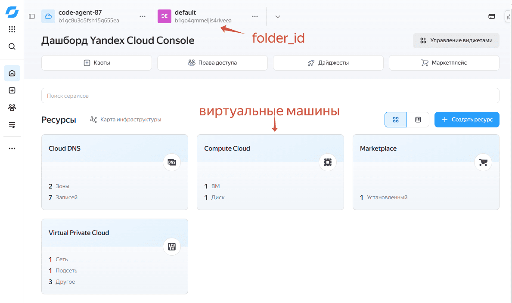
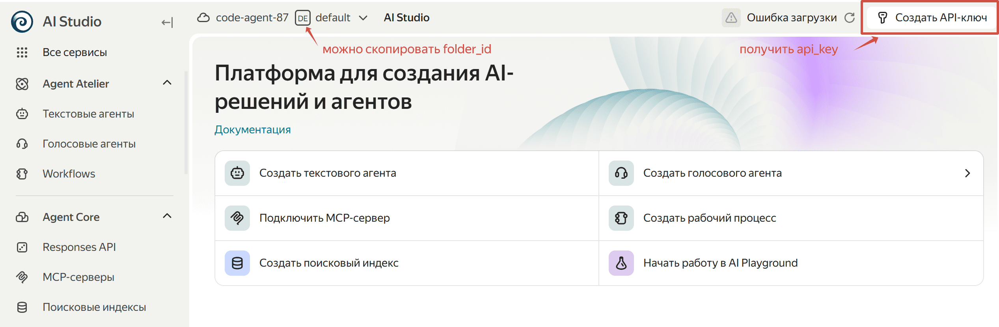

# SCALE 2026 Workshop: Многоагентные системы в Yandex AI Studio: пишем своего кодинг‑агента для анализа данных

[English Version](README_en.md) | [Инструкция для самостоятельного выполнения](README.md)

Это инструкция для мастер-класса **Многоагентные системы в Yandex AI Studio: пишем своего кодинг‑агента для анализа данных**.

## Получаем доступ к Yandex Cloud и AI Studio

В ходе регистрации на мероприятии вы должны были получить письмо, в котором содержатся данные для прохождения воркшопа примерно следующего вида:

```
Имя пользователя: code-agent-XX@yclabs.net
Пароль: ********
```

Это - данные для входа в Yandex Cloud. Заходим в облачную консоль:
* Переходим по адресу [https://console.yandex.cloud](https://console.yandex.cloud/)
* Выбираем **Корпоративный вход**
* Используем имя пользователя и пароль, полученные вами
* При первом входе нужно будет сменить пароль.

В итоге вы попадаете на страницу облачной консоли:



Скопируйте идентификатор каталога `folder_id` - он вам понадобится. После этого зайдите в раздел **Compute Cloud**, чтобы посмотреть на список виртуальных машин.


Скопируйте внешний IP-адрес виртуальной машины и откройте его в отдельном окне браузера с портом 8888:

```
http://xx.xx.xx.xx:8888
```

Далее для работы вам потребуется ключ API Key для работы с моделями в AI Studio. Для его получения зайдите в веб-интерфейс AI Studio: [https://aistudio.yandex.cloud](https://aistudio.yandex.cloud).



